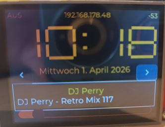
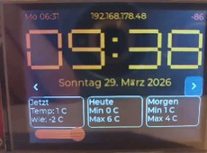
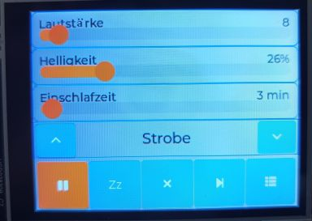
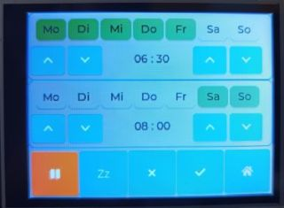
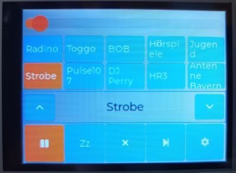
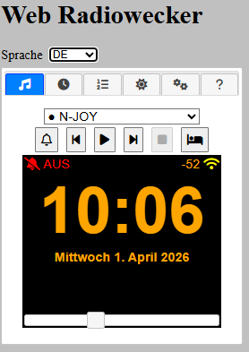
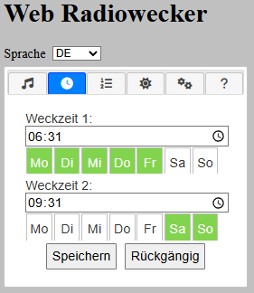
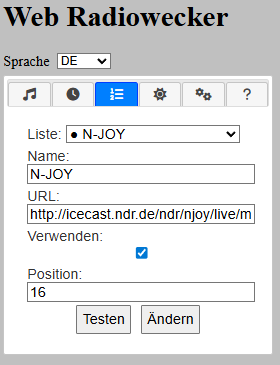
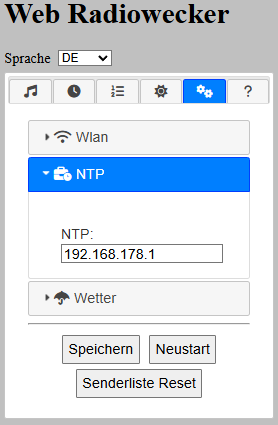
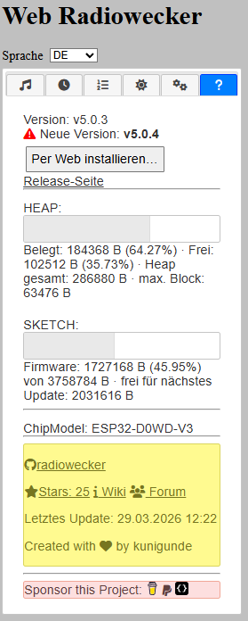

# Internet-Radiowecker mit Touchscreen · **Version 5.0.2**

ESP32-Webradio mit 2,8"-TFT (ILI9341), Touch (XPT2046), Wecker, Wetter, Web-Konfiguration und grafischer Oberfläche auf Basis von **LVGL 9**. Die Firmware meldet sich als **`v5.0.2`** (siehe `RADIOVERSION` in `radiowecker.ino`).

| [:skull: Issues](https://github.com/beabel/radiowecker/issues) | [:speech_balloon: Diskussionen](https://github.com/beabel/radiowecker/discussions) | [:grey_question: Wiki](https://github.com/beabel/radiowecker/wiki) |
|----------------------------------------------------------------|-----------------------------------------------------------------------------------|----------------------------------------------------------------------|

---

## Über dieses Projekt

Dieses Repository ist die **aktuelle Hauptversion** des Radioweckers. Sie basiert auf dem AZ-Delivery-Artikel *[Internet Radiowecker mit Touchscreen](https://www.az-delivery.de/blogs/azdelivery-blog-fur-arduino-und-raspberry-pi/internet-radiowecker-mit-touchscreen)* von **Gerald Lechner** und der weiteren Ausarbeitung für **AZ-Touch MOD** / ESP32.

Was sich gegenüber den **älteren Releases** (z. B. der **4.x-Linie** wie [v4.0.3](https://github.com/beabel/radiowecker/releases)) unterscheidet — Oberfläche, Bibliotheken, Build, Partition — steht im nächsten Abschnitt.

---

## Änderungen gegenüber der Vorgängerversion

Die Vorgängerversionen nutzten überwiegend **direktes Zeichnen** mit **Adafruit GFX** auf dem ILI9341 sowie die Bibliothek **TouchEvent** zur Touch-Auswertung. **v5.0.2** ersetzt die **Hauptoberfläche** durch **LVGL 9** (Widgets, Themes, Animationen). Darunter liegt weiterhin derselbe **ILI9341**-Treiber: LVGL schreibt in einen Puffer, der auf das TFT gezeichnet wird; für wenige Zustände (z. B. WLAN-Verbindungsdialog vor dem Start von LVGL) werden weiterhin **Adafruit_ILI9341**-Aufrufe genutzt.

### Oberfläche und Touch

| Vorher (typisch 4.x) | Ab v5.0.2 |
|----------------------|-----------|
| Touch über **TouchEvent** (Kalibrierung/Events in dieser Bibliothek) | Touch: Weiterhin **XPT2046_Touchscreen** (Rohpunkte), Eingabe wird an **LVGL** angebunden |
| Statische Layouts, viel manuelles Zeichnen | **LVGL**-Screens: Uhr, Einstellungen, Favoriten, Wecker, Fußzeile u. a. |
| Uhrzeit klassisch als Text/Grafik | **Große Ziffern-Uhr** in Kacheln (LVGL, nur Text-Updates — geringe CPU-Last) |
| Senderwechsel u. a. über seitliche Streifen | Sender **Vor/Zurück** als Buttons im **Bereich unter der Uhr / beim Datum**, damit die Uhr frei bleibt |

**TouchEvent** muss **nicht** mehr installiert werden.

### Toolchain und Bibliotheken

| Thema | Vorher | v5.0.2 |
|-------|--------|--------|
| **Arduino IDE** | häufig 1.x / 2.x, in der Doku teils IDE 1 beschrieben | **Arduino IDE 2.x** (Referenz 2.3.8) |
| **ESP32-Arduino-Core** | in der README oft **2.0.17** empfohlen, weil mit **Standard-Partition** der Sketch bei neueren Cores **zu groß** wurde | **Aktueller Core** ist nutzbar, wenn die **Partition „No FS 4MB“** (oder gleichwertig große App-Partition) gesetzt ist |
| **LVGL** | nicht Bestandteil des alten Stacks | **lvgl 9.5.x** zentral für die UI |
| **ESP8266Audio** | z. B. 2.0.0 in der alten Liste | **2.4.1** (Referenz; wie immer Earle F. Philhower) |
| **Adafruit GFX / ILI9341** | Kern der alten Anzeige | weiter installiert; GFX wird von ILI9341 mit eingebunden |

### Flash, Partition und neue Dateien

- **Partition Scheme:** Früher reichte oft das **Default-Layout mit SPIFFS** nicht mehr, sobald Core und Sketch wuchsen. **v5.0.2** setzt auf **„No FS 4MB“**: möglichst **große App-Partition**, kein großes Dateisystem — ausreichend Platz für LVGL, Web- und Audio-Code.  
- **LVGL-Konfiguration:** Zusätzlich zum Sketch ist **`lv_conf.h`** identisch nach **`libraries/lvgl/src/lv_conf.h`** zu kopieren (siehe Abschnitt unten). Ohne diese Kopie fehlen oft Fonts/Features beim Bau der Library.  

### Sonstiges im Code

- Nicht genutzte Definitionen wurden bereinigt (z. B. **Buzzer-Pin** `BEEPER`, falls du ihn bei Bedarf wieder einfügen möchtest: in `00_pin_settings.h` ergänzen und ansteuern).

Wenn du von einem **älteren Stand** migrierst: Sketch komplett ersetzen, Bibliotheken an die Tabelle anpassen, **Partition** umstellen, **`lv_conf.h`** doppelt pflegen, dann **vollständig flashen** (ggf. mit „Erase Flash“).

---

## Benötigte Hardware (Übersicht)

| Komponente | Hinweis |
|------------|---------|
| **ESP32** | z. B. DevKit wie beim AZ-Touch-Set |
| **Display** | ILI9341, 2,8" (beim AZ-Touch MOD integriert) |
| **Touch** | XPT2046 (beim AZ-Touch MOD) |
| **Audio** | I2S-Verstärker (z. B. MAX98357A) + Lautsprecher |
| **Optional** | LDR (Helligkeit) laut `00_pin_settings.h` |

**Pinbelegung** für Display, Touch, I2S und LDR: Datei **`radiowecker/00_pin_settings.h`**. Abweichende Boards: Pins dort anpassen.

---

## Software-Voraussetzungen

### Arduino IDE

- **Arduino IDE 2.3.8** (oder kompatible 2.x-Version)

### ESP32-Boardsupport

- Boardverwalter-URL:  
  `https://raw.githubusercontent.com/espressif/arduino-esp32/gh-pages/package_esp32_index.json`  
- Paket **esp32** von **Espressif Systems** installieren. (Version 3.3.7)

### Bibliotheken (Referenzstände für v5.0.2)

| Bibliothek | Version |
|------------|---------|
| **lvgl** | 9.5.0 |
| **Adafruit GFX Library** | 1.12.5 |
| **Adafruit ILI9341** | 1.6.3 |
| **XPT2046_Touchscreen** | 1.4 |
| **ESP8266Audio** (Earle F. Philhower) | 2.4.1 |

---

## Board-Einstellungen in der Arduino IDE

Unter **Werkzeuge** u. a.:

| Einstellung | Empfehlung |
|-------------|------------|
| **Board** | *ESP32 Dev Module* (oder passend zu deinem Modul) |
| **Flash Size** | *4 MB* (wenn dein Chip 4 MB hat) |
| **Partition Scheme** | **No FS 4MB** |

**Warum „No FS 4MB“?**  
LVGL 9, Webserver, Audio und Einstellungen benötigen eine **große App-Partition**. Schemata mit großem SPIFFS/LittleFS lassen oft zu wenig Flash für den Sketch übrig und führen zu Link- oder Laufzeitproblemen.

- **PSRAM:** nur *Enabled*, wenn dein Board **physikalisch PSRAM** hat.  
- Nach Wechsel des Partitionsschemas ggf. einmal **„Erase All Flash Before Sketch Upload“** aktivieren und neu flashen.

---

## LVGL: Pflichtschritt `lv_conf.h`

Die LVGL-Bibliothek wird mit einer zentralen **`lv_conf.h`** gebaut. Dieses Projekt liefert eine passende Datei im Sketch-Ordner. **Zusätzlich** muss **dieselbe Datei** in der installierten LVGL-Library liegen:

| Aktion | Pfad |
|--------|------|
| Quelle | `radiowecker/lv_conf.h` |
| Ziel (Kopie, Inhalt identisch) | `Arduino/libraries/lvgl/src/lv_conf.h` |

**Typische Pfade:**

- **Windows:** `Benutzer\<Name>\Documents\Arduino\libraries\lvgl\src\lv_conf.h`  
- **macOS / Linux:** `~/Arduino/libraries/lvgl/src/lv_conf.h`

**Wichtig:** Änderst du `lv_conf.h` im Projekt, die Kopie unter `libraries/lvgl/src/` **immer wieder mitüberschreiben**, sonst kompiliert die Library mit alter Konfiguration (fehlende Fonts/Features).

### Kurz-Checkliste vor dem ersten Upload

1. ESP32-Boardsupport installiert, Board & **No FS 4MB** eingestellt.  
2. Bibliotheken laut Tabelle installiert.  
3. `lv_conf.h` nach `libraries/lvgl/src/lv_conf.h` kopiert.  
4. Sketch-Ordner `radiowecker/` vollständig geöffnet.  
5. Kompilieren; bei Fehlern zu Montserrat/LVGL zuerst **`lvgl/src/lv_conf.h`** prüfen.

---

## Ersteinrichtung: WLAN

1. Gerät einschalten. Ohne bekanntes WLAN startet der **Konfigurations-Access-Point** mit der SSID **`radioweckerconf`**.  
2. PC oder Smartphone mit diesem WLAN verbinden.  
3. Browser öffnen: **`http://192.168.4.1`**  
4. Heim-WLAN auswählen, Passwort eintragen, speichern. Das Gerät startet neu und verbindet sich mit dem gewählten Netz.

**Fehlerbehebung:** Keine Verbindung nach dem Speichern → erneut Konfigurationsmodus (wie in früheren Releases: ggf. Reset/Anleitung im Wiki oder in `DOKU/05_Bedienungsanleitung.md`).

---

## Bedienung: Touch-Display (Kurzüberblick)

1. **Obere Statuszeile**  
   - Weckerstatus (nächste Weckzeit / deaktiviert)  
   - IP-Adresse  
   - Schlummer-Hinweis  
   - WLAN-RSSI  

2. **Startseite**  
   - Große **Uhrzeit** als Ziffern-Kacheln (statische Aktualisierung, ressourcenschonend)  
   - **Datum**  
   - **Sender vor/zurück:** seitliche Buttons im **Datumsbereich** (nicht über der Uhr)  
   - **Wetter** bzw. **Radio-Infos** (Sender, Streamtitel) im mittleren Bereich  
   - **Lautstärke:** Schieberegler unten  

3. **Weitere Seiten**  
   - Über den **mittleren Bereich** (transparenter Bereich) zur **Einstellungs-/Radio-Seite** wechseln (wie im bisherigen Konzept; Details in `DOKU/05_Bedienungsanleitung.md`).  
   - **Favoriten**, **Einstellungen**, **Wecker** über Fußzeilen-Navigation.  

4. **Web-Oberfläche**  
   - Im Heimnetz über die im Display angezeigte **IP-Adresse** erreichbar: Stationen, Wecker, WLAN u. a. konfigurieren.

SVG-Übersichten zu den Masken: **`DOKU/Main_Screen_Raster.svg`**, **`DOKU/Config_Screen_Raster.svg`**, **`DOKU/Alarm_Screen_Raster.svg`**.

### Firmware-Updates (Live Webupdate ab Version 5.0.2)

| Weg | Beschreibung |
|-----|----------------|
| **Web-UI (HTTP-OTA)** | Tab **Info**: Vergleich mit dem neuesten GitHub-Release; bei neuerer Version erscheint **„Per Web installieren…“**. Nach Bestätigung lädt das Gerät die Firmware von GitHub und startet neu. Fortschritt wie bei ArduinoOTA auf dem **TFT** (LVGL-OTA-Screen). |
| **ArduinoOTA** | Weiterhin möglich (Hostname/Passwort in `00_settings.h`: `OTA_HOSTNAME`, `OTA_PASSWORD`) — Upload z. B. aus der **Arduino IDE** über den Netzwerk-Port. |

**Voraussetzungen für HTTP-OTA**

- **Partition:** weiterhin **„No FS 4MB“** (zwei OTA-App-Slots à ca. 2 MB).

---

## Module im Sketch (Orientierung)

| Datei / Bereich | Inhalt (kurz) |
|-----------------|---------------|
| `radiowecker.ino` | Setup, Loop, Zeit, Alarmlogik |
| `tft_display.ino` | LVGL-UI, Seiten, Uhr |
| `audio.ino` | Stream, Decoder, I2S |
| `wlan.ino` | WiFi, Verbindung |
| `webserver.ino` | HTTP, API, `index.h` |
| `stations.ino` | Senderliste, Preferences |
| `ota.ino` | ArduinoOTA (Upload aus der IDE / Netzwerk) |
| `http_update.ino` | HTTP-OTA aus der Web-UI (GitHub-Release-Binary) |

---

## English summary (v5.0.2)

- **ESP32** internet clock radio with **ILI9341** + **XPT2046** (library **XPT2046_Touchscreen** required for touch input to LVGL), **LVGL 9.5**, MP3 streams via **ESP8266Audio**, alarms, weather, and a built-in **web UI**. The old **TouchEvent** library is not used.  
- **Arduino IDE 2.x**; install libraries listed above.  
- Set **Partition Scheme** to **No FS 4MB** (large app partition).  
- Copy **`radiowecker/lv_conf.h`** to **`Arduino/libraries/lvgl/src/lv_conf.h`** (must stay in sync). Keep **`build_opt.h`** and **`lv_font_de_supp_14.c`** in the sketch folder.  
- First-time WiFi: join **`radioweckerconf`**, open **`http://192.168.4.1`**, configure home WiFi.
- **Optional firmware update from the browser:** on the **Info** tab, if GitHub has a newer release, use **“Per Web installieren…”** (device downloads **`radiowecker-firmware.bin`** from the matching release tag). 

**Compared to earlier releases (e.g. 4.x):** main UI moved from raw **Adafruit GFX** + **TouchEvent** to **LVGL 9**; **XPT2046_Touchscreen** remains; **ArduinoJson** is bundled in the sketch; **partition layout** must provide a large app region; add **`lv_conf.h`** copy under **`lvgl/src/`** and use **`build_opt.h`**.

---

## Danksagung

- **Gerald Lechner** und **AZ-Delivery** für die ursprüngliche Projektidee und Dokumentation.  
- **Earle F. Philhower** (ESP8266Audio), **LVGL**, **Adafruit**, **Paul Stoffregen** (XPT2046) für die verwendeten Bibliotheken.

---

## Screenshots — so sieht es aus

Fotos aus dem Ordner [`screenshot/`](screenshot/). **`display_*`** = TFT (LVGL), **`webseite_*`** = HTML-Ausgabe im Browser. Ausführliche Einordnung: [`DOKU/05_Bedienungsanleitung.md`](DOKU/05_Bedienungsanleitung.md).

### TFT (Display)

**Startseite, Radio an**

**Startseite, Radio aus, Wetter**

**Einstellungen**

**Wecker**

**Favoriten**

### Webseite (HTML im Browser)

**Startseite**

**Wecker**

**Radiosender**

**Einstellungen**

**Info**

---

 
 

---

**Radiowecker · Version 5.0.2**

